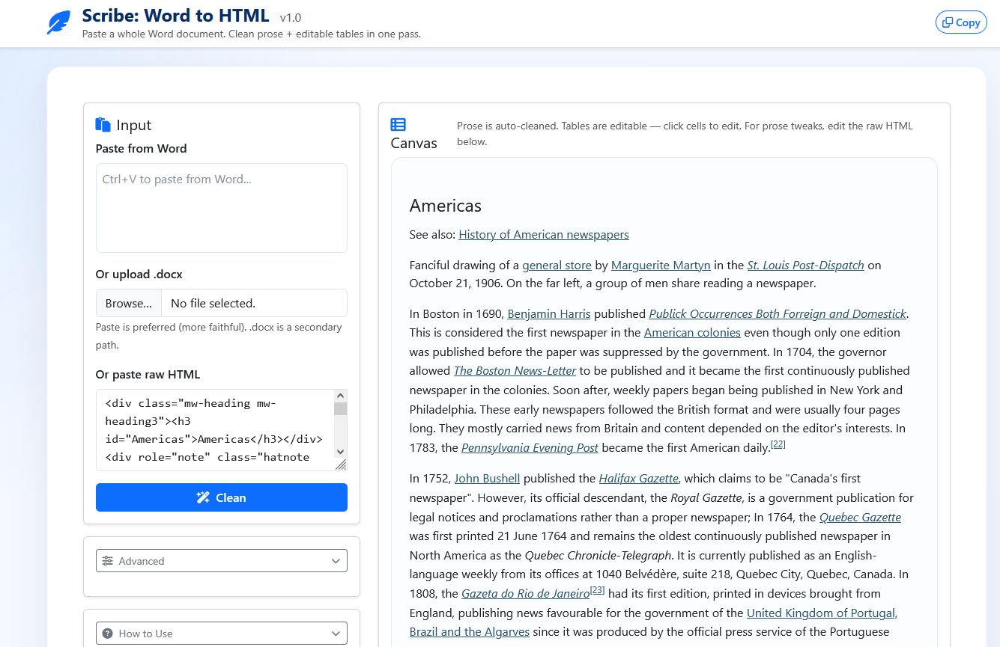

# Scribe: Word to HTML

Convert Word documents into clean Canada.ca-ready HTML.

## Author / Creator

**Daniel Brown, IS-03, FedDev Ontario**

## Usage

Scribe lives in the `editor/` folder. It is a double-clickable web app — **no build step, no server, no internet required** (Bootstrap, Font Awesome, and the .docx converter are all vendored locally).

1. Open `editor/index.html` in any modern browser (Chrome, Edge, Firefox).
2. Paste Word content into the Live view (or upload a `.docx`).
3. Edit visually in Live view or directly in Code view — both stay in sync as you type. Split view puts them side by side; clicking an element in one view jumps the other to the matching spot. Click a table cell to activate the table editor (header, merge, active, footer, bold, indent, NBSP, alignment, caption, presets).
4. Click **Copy HTML** — image placeholders serialize as `<!-- image: ... -->` comments in the output.

> **Testing (developers only):** `cd editor && npm install && npm test` runs the vitest suite (needs Node; the editor itself does not).
